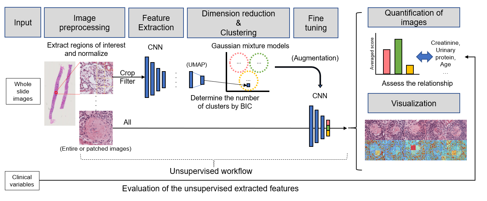
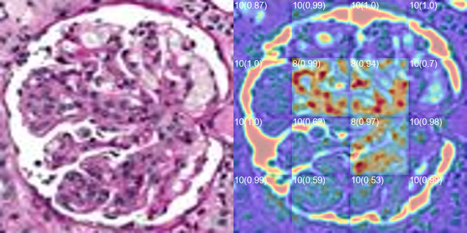
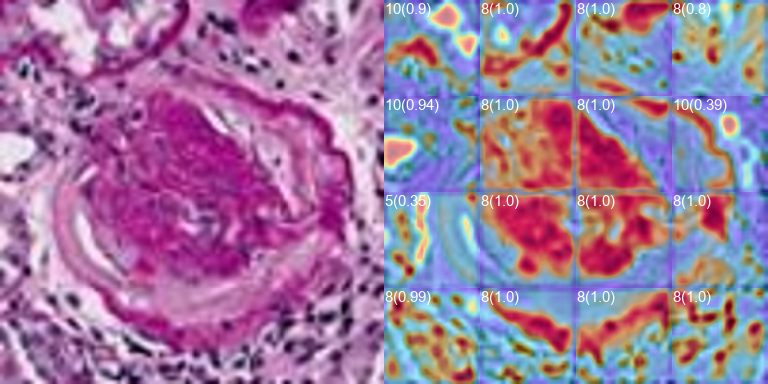

## Weights
- patch_model_he.hdf5: the model of the patch-based analysis
- [NASNet weight](https://figshare.com/s/99d16ebdb65c49be1107)

## Dataset
- 227 x 227 images
- G. Bueno, M.M. Fernandez-Carrobles, L. Gonzalez-Lopez, O. Deniz, Glomerulosclerosis identification in whole slide images using semantic segmentation, Comput. Methods Programs Biomed. 184 (2020) 105273.
- [Data for glomeruli characterization in histopathological images](http://dx.doi.org/10.17632/k7nvtgn2x6.3)  
- [CC BY 4.0](https://creativecommons.org/licenses/by/4.0/)

## Results
The model was trained for H&E normalized images, and the images in the dataset are PAS-stained. 
This is for the testing purpose. 

### Examples of the visualization
- Normal glomerulus

- Sclerotic glomerulus
